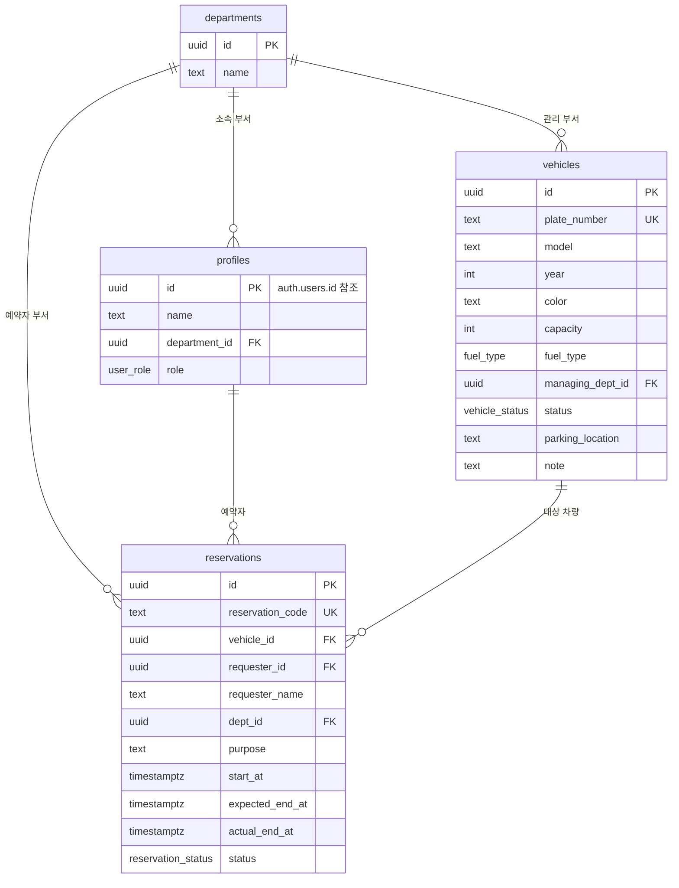

# 차량운영시스템 DB 설계 (DB.md)

> `PRD.md`의 데이터 모델(5장)을 기반으로 한 Supabase(PostgreSQL) 스키마 정의서.
> 프런트엔드 개발 시 이 문서를 기준으로 Supabase 클라이언트 쿼리를 작성한다.

| 항목 | 내용 |
|---|---|
| 문서 버전 | v1.0 |
| 작성일 | 2026-07-14 |
| 대상 DB | Supabase (PostgreSQL) |

---

## 1. 개요

테이블 4개로 구성한다.

- `departments` : 부서 마스터
- `profiles` : 로그인 사용자 프로필 (Supabase `auth.users` 확장)
- `vehicles` : 차량 마스터 (`carlist.xlsx` - 차량목록 시트 기준)
- `reservations` : 예약/대여 이력 (`carlist.xlsx` - 대여대장 시트 기준)

핵심 설계 포인트:
1. **예약 시간 겹침은 DB 제약조건(EXCLUDE)으로 원천 차단** — 애플리케이션 로직 실수에 의존하지 않음
2. **차량 상태(`vehicles.status`)는 예약 상태 변경 트리거로 자동 동기화** — 수동 업데이트 누락 방지
3. **정비중 차량은 트리거가 자동으로 `운행가능`으로 되돌리지 않음** — 관리자 수동 통제 유지

---

## 2. ERD



---

## 3. 사전 준비 (Extension)

시간 범위 겹침 검사를 위해 `btree_gist`가 필요하다.

```sql
CREATE EXTENSION IF NOT EXISTS btree_gist;
```

---

## 4. ENUM 타입 정의

기존 엑셀 값(한글)을 그대로 사용해 프런트엔드-DB 간 변환 로직을 최소화한다.

```sql
CREATE TYPE fuel_type AS ENUM ('가솔린', '디젤', '하이브리드', '전기');

CREATE TYPE vehicle_status AS ENUM ('운행가능', '운행중', '정비중');

CREATE TYPE reservation_status AS ENUM ('예약됨', '대여중', '반납완료', '취소됨');

CREATE TYPE user_role AS ENUM ('employee', 'admin');
```

> `취소됨`은 PRD의 오픈 이슈에서 제안한 신규 상태로, 기존 엑셀에는 없었지만 예약 취소 기능 구현을 위해 추가.

---

## 5. 테이블 정의

### 5.1 departments (부서 마스터)

```sql
CREATE TABLE departments (
  id          uuid PRIMARY KEY DEFAULT gen_random_uuid(),
  name        text NOT NULL UNIQUE,
  created_at  timestamptz NOT NULL DEFAULT now()
);
```

### 5.2 profiles (사용자 프로필)

Supabase `auth.users`를 확장하는 테이블. 회원가입 시 트리거로 자동 생성한다(7.4 참고).

```sql
CREATE TABLE profiles (
  id              uuid PRIMARY KEY REFERENCES auth.users (id) ON DELETE CASCADE,
  name            text NOT NULL,
  department_id   uuid REFERENCES departments (id),
  role            user_role NOT NULL DEFAULT 'employee',
  created_at      timestamptz NOT NULL DEFAULT now(),
  updated_at      timestamptz NOT NULL DEFAULT now()
);
```

### 5.3 vehicles (차량 마스터)

`carlist.xlsx` "차량목록" 시트의 컬럼과 1:1 매핑된다.

```sql
CREATE TABLE vehicles (
  id                 uuid PRIMARY KEY DEFAULT gen_random_uuid(),
  plate_number       text NOT NULL UNIQUE,              -- 차량번호, 예: '12가 3456'
  model              text NOT NULL,                      -- 차종
  year               integer NOT NULL CHECK (year BETWEEN 1990 AND 2100), -- 연식
  color              text,                                -- 색상
  capacity           integer NOT NULL CHECK (capacity > 0), -- 정원
  fuel_type          fuel_type NOT NULL,                  -- 연료
  managing_dept_id   uuid REFERENCES departments (id),    -- 부서(관리)
  status             vehicle_status NOT NULL DEFAULT '운행가능', -- 상태
  parking_location   text,                                -- 주차위치
  note               text,                                -- 비고
  created_at         timestamptz NOT NULL DEFAULT now(),
  updated_at         timestamptz NOT NULL DEFAULT now()
);
```

### 5.4 reservations (예약/대여 이력)

`carlist.xlsx` "대여대장" 시트 기준. `requester_id`는 로그인 연동 후 사용, `requester_name`은 표시용으로 항상 저장한다.

```sql
CREATE TABLE reservations (
  id                 uuid PRIMARY KEY DEFAULT gen_random_uuid(),
  reservation_code   text UNIQUE,                         -- 예약번호, 예: 'R2026091' (트리거로 자동 채번, 7.3 참고)
  vehicle_id         uuid NOT NULL REFERENCES vehicles (id),
  requester_id       uuid REFERENCES profiles (id),        -- 로그인 사용자 (nullable: 과거 이력/비로그인 데이터 허용)
  requester_name     text NOT NULL,                        -- 예약자명 (표시용 스냅샷)
  dept_id            uuid REFERENCES departments (id),     -- 예약자 부서 (차량 관리부서와 다를 수 있음)
  purpose            text NOT NULL,                        -- 대여목적
  start_at           timestamptz NOT NULL,                 -- 출발일시
  expected_end_at    timestamptz NOT NULL,                 -- 반납예정일시
  actual_end_at      timestamptz,                          -- 실제반납일시
  status             reservation_status NOT NULL DEFAULT '예약됨',
  created_at         timestamptz NOT NULL DEFAULT now(),
  updated_at         timestamptz NOT NULL DEFAULT now(),

  CONSTRAINT chk_expected_after_start CHECK (expected_end_at > start_at),
  CONSTRAINT chk_actual_after_start CHECK (actual_end_at IS NULL OR actual_end_at >= start_at)
);
```

---

## 6. 예약 시간 겹침 방지 (핵심 제약조건)

동일 차량에 대해 `예약됨`/`대여중` 상태끼리 시간대가 겹치는 예약은 DB 레벨에서 생성 자체가 불가능하도록 막는다. (엑셀 관리의 가장 큰 문제였던 "중복 예약"을 근본적으로 제거)

```sql
ALTER TABLE reservations
  ADD CONSTRAINT reservations_no_overlap
  EXCLUDE USING gist (
    vehicle_id WITH =,
    tstzrange(start_at, expected_end_at, '[)') WITH &&
  )
  WHERE (status IN ('예약됨', '대여중'));
```

- `'[)'` 옵션으로 반납예정시각과 다음 출발시각이 정확히 맞닿는 경우(예: 12:00 반납 → 12:00 출발)는 겹침으로 보지 않는다.
- `반납완료`, `취소됨` 상태는 검사 대상에서 제외되므로 과거 이력과는 시간이 겹쳐도 문제 없다.

---

## 7. 트리거 / 함수

### 7.1 `updated_at` 자동 갱신

```sql
CREATE OR REPLACE FUNCTION set_updated_at()
RETURNS trigger AS $$
BEGIN
  NEW.updated_at = now();
  RETURN NEW;
END;
$$ LANGUAGE plpgsql;

CREATE TRIGGER trg_vehicles_updated_at
  BEFORE UPDATE ON vehicles
  FOR EACH ROW EXECUTE FUNCTION set_updated_at();

CREATE TRIGGER trg_reservations_updated_at
  BEFORE UPDATE ON reservations
  FOR EACH ROW EXECUTE FUNCTION set_updated_at();

CREATE TRIGGER trg_profiles_updated_at
  BEFORE UPDATE ON profiles
  FOR EACH ROW EXECUTE FUNCTION set_updated_at();
```

### 7.2 차량 상태 자동 동기화

예약 상태가 바뀌면 연결된 차량의 `status`를 자동으로 갱신한다. 단, 차량이 이미 `정비중`이면 `운행가능`으로 되돌리지 않는다(관리자 수동 통제 우선).

> **주의(실제 배포 후 발견된 버그 수정)**: 이 함수는 반드시 `SECURITY DEFINER`여야 한다. 일반 함수(호출자 권한)로 만들면, 예약자가 일반 직원(비관리자)일 때 트리거 내부의 `vehicles` UPDATE가 `vehicles_admin_update` RLS 정책(관리자만 허용)에 막혀 **에러 없이 조용히 무시**된다 — 즉 예약은 정상 처리되지만 차량 상태가 갱신되지 않는 버그가 발생한다. REST API로 실제 재현·검증 후 아래와 같이 수정함.

```sql
CREATE OR REPLACE FUNCTION sync_vehicle_status()
RETURNS trigger
LANGUAGE plpgsql
SECURITY DEFINER
SET search_path = public
AS $$
BEGIN
  IF NEW.status = '대여중' THEN
    UPDATE vehicles SET status = '운행중'
    WHERE id = NEW.vehicle_id;
  ELSIF NEW.status IN ('반납완료', '취소됨') THEN
    UPDATE vehicles SET status = '운행가능'
    WHERE id = NEW.vehicle_id AND status <> '정비중';
  END IF;
  RETURN NEW;
END;
$$;

REVOKE EXECUTE ON FUNCTION sync_vehicle_status() FROM PUBLIC, anon, authenticated;

CREATE TRIGGER trg_sync_vehicle_status
  AFTER INSERT OR UPDATE OF status ON reservations
  FOR EACH ROW EXECUTE FUNCTION sync_vehicle_status();
```

### 7.3 예약번호 자동 채번

기존 엑셀의 `R2026###` 형식을 유지한다. 값이 명시적으로 주어지면(예: 과거 데이터 시드) 그대로 사용하고, 없으면 자동 생성한다.

```sql
CREATE SEQUENCE IF NOT EXISTS reservation_code_seq;

CREATE OR REPLACE FUNCTION generate_reservation_code()
RETURNS trigger AS $$
BEGIN
  IF NEW.reservation_code IS NULL THEN
    NEW.reservation_code := 'R' || to_char(now(), 'YYYY')
      || lpad(nextval('reservation_code_seq')::text, 3, '0');
  END IF;
  RETURN NEW;
END;
$$ LANGUAGE plpgsql;

CREATE TRIGGER trg_generate_reservation_code
  BEFORE INSERT ON reservations
  FOR EACH ROW EXECUTE FUNCTION generate_reservation_code();
```

> 시드 데이터 삽입 후에는 `ALTER SEQUENCE reservation_code_seq RESTART WITH 101;`로 다음 채번이 101부터 이어지도록 맞춘다(9장 참고).

### 7.4 신규 가입 시 프로필 자동 생성

```sql
CREATE OR REPLACE FUNCTION handle_new_user()
RETURNS trigger AS $$
BEGIN
  INSERT INTO public.profiles (id, name, role)
  VALUES (NEW.id, COALESCE(NEW.raw_user_meta_data ->> 'name', NEW.email), 'employee');
  RETURN NEW;
END;
$$ LANGUAGE plpgsql SECURITY DEFINER;

CREATE TRIGGER trg_handle_new_user
  AFTER INSERT ON auth.users
  FOR EACH ROW EXECUTE FUNCTION handle_new_user();
```

---

## 8. 인덱스

```sql
CREATE INDEX idx_vehicles_status           ON vehicles (status);
CREATE INDEX idx_vehicles_managing_dept    ON vehicles (managing_dept_id);

CREATE INDEX idx_reservations_vehicle_id   ON reservations (vehicle_id);
CREATE INDEX idx_reservations_status       ON reservations (status);
CREATE INDEX idx_reservations_start_at     ON reservations (start_at);
CREATE INDEX idx_reservations_requester_id ON reservations (requester_id);
```

---

## 9. 조회 편의 뷰

예약 목록/타임라인 화면에서 조인 없이 바로 쓸 수 있도록 상세 뷰를 제공한다.

```sql
CREATE OR REPLACE VIEW v_reservations_detail AS
SELECT
  r.id,
  r.reservation_code,
  r.purpose,
  r.start_at,
  r.expected_end_at,
  r.actual_end_at,
  r.status,
  v.id           AS vehicle_id,
  v.plate_number,
  v.model,
  d.name         AS dept_name,
  r.requester_name
FROM reservations r
JOIN vehicles v      ON v.id = r.vehicle_id
LEFT JOIN departments d ON d.id = r.dept_id;
```

---

## 10. RLS (Row Level Security) 정책

관리자 판별용 헬퍼 함수(재귀적 RLS 평가를 피하기 위해 `SECURITY DEFINER` 사용):

```sql
CREATE OR REPLACE FUNCTION is_admin()
RETURNS boolean
LANGUAGE sql SECURITY DEFINER STABLE AS $$
  SELECT EXISTS (
    SELECT 1 FROM public.profiles WHERE id = auth.uid() AND role = 'admin'
  );
$$;
```

### 10.1 departments

```sql
ALTER TABLE departments ENABLE ROW LEVEL SECURITY;

CREATE POLICY departments_select_all ON departments
  FOR SELECT USING (true);

CREATE POLICY departments_admin_write ON departments
  FOR INSERT WITH CHECK (is_admin());

CREATE POLICY departments_admin_update ON departments
  FOR UPDATE USING (is_admin()) WITH CHECK (is_admin());

CREATE POLICY departments_admin_delete ON departments
  FOR DELETE USING (is_admin());
```

### 10.2 profiles

```sql
ALTER TABLE profiles ENABLE ROW LEVEL SECURITY;

CREATE POLICY profiles_select_all ON profiles
  FOR SELECT USING (true);

CREATE POLICY profiles_update_self ON profiles
  FOR UPDATE USING (id = auth.uid()) WITH CHECK (id = auth.uid());

CREATE POLICY profiles_admin_all ON profiles
  FOR ALL USING (is_admin()) WITH CHECK (is_admin());
```

### 10.3 vehicles

```sql
ALTER TABLE vehicles ENABLE ROW LEVEL SECURITY;

CREATE POLICY vehicles_select_all ON vehicles
  FOR SELECT TO authenticated USING (true);

CREATE POLICY vehicles_admin_insert ON vehicles
  FOR INSERT WITH CHECK (is_admin());

CREATE POLICY vehicles_admin_update ON vehicles
  FOR UPDATE USING (is_admin()) WITH CHECK (is_admin());

CREATE POLICY vehicles_admin_delete ON vehicles
  FOR DELETE USING (is_admin());
```

### 10.4 reservations

일반 사용자는 조회는 전체 가능(차량 예약 현황을 봐야 하므로), 생성/수정은 본인 예약 건 또는 관리자만 가능하다.

```sql
ALTER TABLE reservations ENABLE ROW LEVEL SECURITY;

CREATE POLICY reservations_select_all ON reservations
  FOR SELECT TO authenticated USING (true);

CREATE POLICY reservations_insert_self_or_admin ON reservations
  FOR INSERT WITH CHECK (requester_id = auth.uid() OR is_admin());

CREATE POLICY reservations_update_self_or_admin ON reservations
  FOR UPDATE USING (requester_id = auth.uid() OR is_admin())
  WITH CHECK (requester_id = auth.uid() OR is_admin());

CREATE POLICY reservations_delete_admin ON reservations
  FOR DELETE USING (is_admin());
```

---

## 11. 시드 데이터 (carlist.xlsx 실제 데이터)

기존 엑셀 원본을 그대로 이관한 시드 스크립트. 로컬/개발 환경에서 초기 데이터로 사용한다.

### 11.1 부서

```sql
INSERT INTO departments (name) VALUES
  ('총무팀'), ('개발팀'), ('마케팅팀'), ('인사팀'), ('경영지원팀'), ('영업팀');
```

### 11.2 차량 (20대)

```sql
INSERT INTO vehicles (plate_number, model, year, color, capacity, fuel_type, managing_dept_id, status, parking_location, note)
SELECT v.plate_number, v.model, v.year, v.color, v.capacity, v.fuel_type::fuel_type, d.id, v.status::vehicle_status, v.parking_location, v.note
FROM (VALUES
  ('12가 3456', '아반떼',          2022, '흰색',     5, '가솔린',    '총무팀',     '운행가능', '본관 지하1층 2번',  NULL),
  ('34나 5678', '쏘나타',          2021, '검정색',   5, '가솔린',    '개발팀',     '운행가능', '본관 지하1층 3번',  NULL),
  ('56다 7890', '그랜저',          2023, '펄화이트', 5, '하이브리드', '마케팅팀',   '운행중',   '본관 지하1층 4번',  NULL),
  ('78라 1234', '카니발',          2022, '은색',     9, '디젤',      '인사팀',     '정비중',   '본관 지하1층 5번',  NULL),
  ('90마 2345', '스타렉스',        2020, '흰색',    12, '디젤',      '경영지원팀', '운행가능', '본관 지하1층 6번',  NULL),
  ('11바 3456', '포터2',           2021, '흰색',     3, '디젤',      '영업팀',     '운행가능', '본관 지하1층 7번',  NULL),
  ('22사 4567', 'K5',              2022, '회색',     5, '가솔린',    '총무팀',     '운행가능', '본관 지하1층 8번',  '겨울용 스노우체인 비치'),
  ('33아 5678', '아이오닉5',       2023, '회색',     5, '전기',      '개발팀',     '운행중',   '본관 지하1층 9번',  NULL),
  ('44자 6789', '투싼',            2021, '검정색',   5, '가솔린',    '마케팅팀',   '정비중',   '본관 지하1층 10번', NULL),
  ('55차 7890', '쏘렌토',          2022, '흰색',     7, '디젤',      '인사팀',     '운행가능', '본관 지하2층 1번',  NULL),
  ('66카 8901', '레이',            2020, '노란색',   4, '가솔린',    '경영지원팀', '운행가능', '본관 지하2층 2번',  NULL),
  ('77타 9012', '모닝',            2019, '빨간색',   4, '가솔린',    '영업팀',     '운행가능', '본관 지하2층 3번',  NULL),
  ('88파 0123', '스포티지',        2023, '은색',     5, '하이브리드', '총무팀',     '운행중',   '본관 지하2층 4번',  NULL),
  ('99하 1234', 'K8',              2023, '검정색',   5, '가솔린',    '개발팀',     '정비중',   '본관 지하2층 5번',  '겨울용 스노우체인 비치'),
  ('13가 2345', '팰리세이드',      2022, '흰색',     7, '디젤',      '마케팅팀',   '운행가능', '본관 지하2층 6번',  NULL),
  ('24나 3456', '니로',            2021, '회색',     5, '하이브리드', '인사팀',     '운행가능', '본관 지하2층 7번',  NULL),
  ('35다 4567', 'EV6',             2023, '흰색',     5, '전기',      '경영지원팀', '운행가능', '본관 지하2층 8번',  NULL),
  ('46라 5678', '그랜드 스타렉스', 2019, '은색',    11, '디젤',      '영업팀',     '운행중',   '본관 지하2층 9번',  NULL),
  ('57마 6789', '봉고3',           2020, '흰색',     3, '디젤',      '총무팀',     '정비중',   '본관 지하2층 10번', NULL),
  ('68바 7890', '제네시스 G80',    2023, '검정색',   5, '가솔린',    '개발팀',     '운행가능', '본관 지하1층 1번',  NULL)
) AS v(plate_number, model, year, color, capacity, fuel_type, dept_name, status, parking_location, note)
JOIN departments d ON d.name = v.dept_name;
```

### 11.3 예약/대여 이력 (30건)

```sql
INSERT INTO reservations (reservation_code, vehicle_id, requester_name, dept_id, purpose, start_at, expected_end_at, actual_end_at, status)
SELECT r.reservation_code, veh.id, r.requester_name, d.id, r.purpose,
       r.start_at::timestamptz, r.expected_end_at::timestamptz, r.actual_end_at::timestamptz, r.status::reservation_status
FROM (VALUES
  ('R2026071', '78라 1234', '김민준', '경영지원팀', '행사 지원',   '2026-07-09 12:00', '2026-07-09 15:00', '2026-07-09 15:30', '반납완료'),
  ('R2026072', '56다 7890', '임지호', '마케팅팀',   '거래처 미팅', '2026-07-06 10:00', '2026-07-06 13:00', '2026-07-06 13:30', '반납완료'),
  ('R2026073', '68바 7890', '김민준', '인사팀',     '현장 답사',   '2026-07-14 15:00', '2026-07-14 18:00', NULL,                '대여중'),
  ('R2026074', '57마 6789', '정하은', '영업팀',     '물품 배송',   '2026-07-12 14:00', '2026-07-12 18:00', '2026-07-12 17:50', '반납완료'),
  ('R2026075', '66카 8901', '이서연', '영업팀',     '공항 픽업',   '2026-07-18 09:00', '2026-07-18 13:00', NULL,                '예약됨'),
  ('R2026076', '13가 2345', '장서윤', '영업팀',     '공항 픽업',   '2026-07-18 12:00', '2026-07-18 16:00', NULL,                '예약됨'),
  ('R2026077', '56다 7890', '김민준', '경영지원팀', '현장 답사',   '2026-07-10 10:00', '2026-07-10 13:00', '2026-07-10 13:15', '반납완료'),
  ('R2026078', '44자 6789', '윤예준', '경영지원팀', '고객사 방문', '2026-07-08 14:00', '2026-07-08 18:00', '2026-07-08 18:00', '반납완료'),
  ('R2026079', '56다 7890', '임지호', '경영지원팀', '물품 배송',   '2026-07-14 12:00', '2026-07-14 15:00', NULL,                '대여중'),
  ('R2026080', '88파 0123', '정하은', '경영지원팀', '현장 답사',   '2026-07-11 09:00', '2026-07-11 12:00', '2026-07-11 12:00', '반납완료'),
  ('R2026081', '88파 0123', '정하은', '영업팀',     '현장 답사',   '2026-07-15 14:00', '2026-07-15 17:00', NULL,                '대여중'),
  ('R2026082', '88파 0123', '황서아', '경영지원팀', '자재 운반',   '2026-07-08 13:00', '2026-07-08 16:00', '2026-07-08 16:30', '반납완료'),
  ('R2026083', '46라 5678', '정하은', '경영지원팀', '공항 픽업',   '2026-07-15 15:00', '2026-07-15 19:00', '2026-07-15 18:50', '반납완료'),
  ('R2026084', '35다 4567', '윤예준', '영업팀',     '거래처 미팅', '2026-07-07 11:00', '2026-07-08 11:00', '2026-07-08 11:15', '반납완료'),
  ('R2026085', '68바 7890', '이서연', '마케팅팀',   '공항 픽업',   '2026-07-15 16:00', '2026-07-16 00:00', '2026-07-16 00:30', '반납완료'),
  ('R2026086', '12가 3456', '한소율', '경영지원팀', '출장',       '2026-07-14 13:00', '2026-07-15 13:00', '2026-07-15 12:40', '반납완료'),
  ('R2026087', '55차 7890', '조유나', '총무팀',     '자재 운반',   '2026-07-06 13:00', '2026-07-06 21:00', '2026-07-06 21:30', '반납완료'),
  ('R2026088', '78라 1234', '권민재', '경영지원팀', '행사 지원',   '2026-07-14 12:00', '2026-07-14 15:00', '2026-07-14 14:50', '반납완료'),
  ('R2026089', '46라 5678', '신아윤', '인사팀',     '거래처 미팅', '2026-07-15 14:00', '2026-07-15 20:00', '2026-07-15 19:40', '반납완료'),
  ('R2026090', '77타 9012', '황서아', '개발팀',     '현장 답사',   '2026-07-06 12:00', '2026-07-06 20:00', '2026-07-06 19:40', '반납완료'),
  ('R2026091', '24나 3456', '권민재', '영업팀',     '물품 배송',   '2026-07-08 16:00', '2026-07-09 00:00', '2026-07-09 00:00', '반납완료'),
  ('R2026092', '35다 4567', '권민재', '인사팀',     '공항 픽업',   '2026-07-09 17:00', '2026-07-10 17:00', '2026-07-10 17:00', '반납완료'),
  ('R2026093', '88파 0123', '한소율', '경영지원팀', '고객사 방문', '2026-07-13 17:00', '2026-07-13 23:00', '2026-07-13 22:50', '반납완료'),
  ('R2026094', '33아 5678', '이서연', '개발팀',     '거래처 미팅', '2026-07-17 09:00', '2026-07-17 12:00', NULL,                '예약됨'),
  ('R2026095', '56다 7890', '오준서', '경영지원팀', '거래처 미팅', '2026-07-09 10:00', '2026-07-09 12:00', '2026-07-09 11:40', '반납완료'),
  ('R2026096', '35다 4567', '최지우', '개발팀',     '자재 운반',   '2026-07-20 16:00', '2026-07-20 19:00', NULL,                '예약됨'),
  ('R2026097', '33아 5678', '신아윤', '마케팅팀',   '공항 픽업',   '2026-07-09 10:00', '2026-07-09 12:00', NULL,                '대여중'),
  ('R2026098', '77타 9012', '조유나', '마케팅팀',   '자재 운반',   '2026-07-06 10:00', '2026-07-06 12:00', NULL,                '대여중'),
  ('R2026099', '66카 8901', '신아윤', '영업팀',     '현장 답사',   '2026-07-09 12:00', '2026-07-09 20:00', NULL,                '대여중'),
  ('R2026100', '90마 2345', '조유나', '총무팀',     '행사 지원',   '2026-07-13 12:00', '2026-07-13 14:00', NULL,                '대여중')
) AS r(reservation_code, plate_number, requester_name, dept_name, purpose, start_at, expected_end_at, actual_end_at, status)
JOIN vehicles veh    ON veh.plate_number = r.plate_number
JOIN departments d   ON d.name = r.dept_name;

-- 이후 신규 예약은 101번부터 자동 채번되도록 시퀀스 보정
ALTER SEQUENCE reservation_code_seq RESTART WITH 101;
```

> 검증: 위 시드 데이터는 6장의 겹침 방지 제약조건(`reservations_no_overlap`)을 위반하지 않도록 이미 확인됨 (동일 차량의 `대여중`/`예약됨` 상태 건끼리는 시간대가 겹치지 않음).

---

## 12. 마이그레이션 파일 구성 (제안)

Supabase CLI 기준 `supabase/migrations/` 폴더에 아래 순서로 분리 관리한다.

```
0001_extensions.sql        -- 3장
0002_enums.sql             -- 4장
0003_tables.sql            -- 5장
0004_constraints.sql       -- 6장
0005_functions_triggers.sql-- 7장
0006_indexes_views.sql     -- 8, 9장
0007_rls_policies.sql      -- 10장
0008_seed.sql              -- 11장 (개발 환경 전용, 운영 배포 시 제외)
```

---

## 13. 참고 / 열린 이슈

- `PRD.md` 11장의 오픈 이슈(로그인 방식, 취소 정책, 부서 마스터 변경 가능 여부)에 따라 `profiles.department_id` FK, `reservations_delete_admin` 정책 등은 조정될 수 있음
- 반납 지연 자동 알림 등 향후 기능 추가 시 `reservations`에 `notified_at` 등 컬럼 확장 여지 있음
- 예약 취소 시점 제한(예: 출발 1시간 전까지만 취소 가능)이 확정되면 `reservations_update_self_or_admin` 정책에 시간 조건 추가 필요
- **Realtime**: 프런트엔드가 실시간 갱신을 구독하려면 `vehicles`, `reservations` 테이블을 `supabase_realtime` publication에 추가해야 한다(`ALTER PUBLICATION supabase_realtime ADD TABLE vehicles, reservations;`). 배포 시 적용 완료.
- **Auth 설정(대시보드에서 별도 확인 필요)**: 이메일 인증(Confirm email) 여부와 "Leaked Password Protection"은 SQL이 아닌 Supabase 대시보드/Auth 설정에서 관리된다. 현재 이 프로젝트는 이메일 인증 없이 가입 즉시 세션이 발급되는 상태로 확인됨.
- `btree_gist` 확장이 `public` 스키마에 설치되어 있다는 linter 경고(`extension_in_public`, WARN)가 있으나, 겹침 방지 EXCLUDE 제약조건이 이 확장에 의존하므로 스키마 이전은 보류함(위험 대비 실익이 낮은 경미한 경고).
